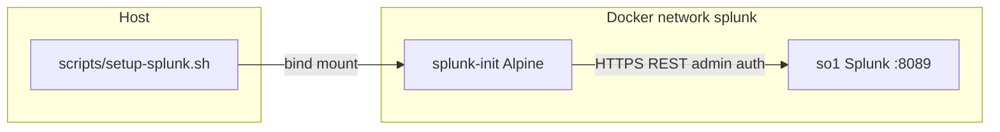
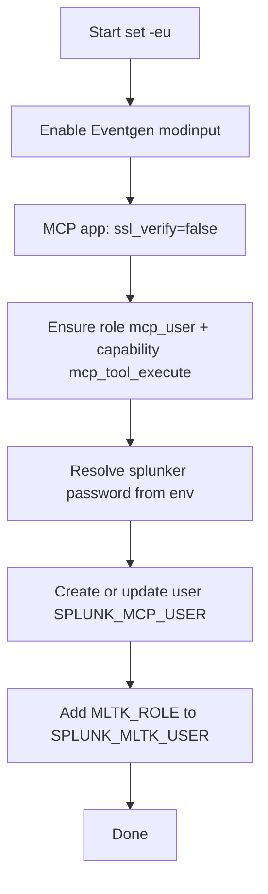

## compose.yml

**`SPLUNK_APPS_URL`** in **`compose.yml`** is a comma-separated list of Splunkbase download URLs; the **`compose.yml`** comments identify each app. Current entries (app ID → name):

| App ID | App | Pinned release |
| ------ | --- | -------------- |
| 1924 | SA-Eventgen (sample data / Eventgen modinput) | 8.2.2 |
| 4353 | Config Explorer (optional UI utility) | 1.8.24 |
| 7931 | Splunk MCP Server (required for `/services/mcp`) | 1.2.0 |
| 7245 | Splunk AI Assistant for SPL | 2.0.0 |
| 2882 | Python for Scientific Computing (Linux x86_64; MLTK / Connection Management needs this) | 4.3.2 |
| 2890 | Splunk AI Toolkit | 5.7.4 |

Check current Splunkbase releases: `https://splunkbase.splunk.com/api/v1/app/<id>/release/` (first entry is latest). Update the `/release/VERSION/` segment in **`compose.yml`** when bumping.

### Service `so1` (Splunk)

| Setting | Meaning |
| ------- | ------- |
| `image` | `${SPLUNK_IMAGE:-splunk/splunk:latest}` |
| `platform: linux/amd64` | Run x86 image on ARM via emulation when needed |
| `SPLUNK_GENERAL_TERMS` | Accepts Splunk general terms non-interactively |
| `SPLUNK_START_ARGS` | License acceptance |
| `SPLUNK_PASSWORD` | Admin password (from `.env` and/or `op run` / shell env) |
| `SPLUNKBASE_USERNAME` / `SPLUNKBASE_PASSWORD` | Splunkbase downloads |
| `SPLUNK_APPS_URL` | Comma-separated Splunkbase package URLs |
| `TZ` | Container timezone (default `Europe/Brussels` in template) |

**Ports**

- `8000` — Splunk Web
- `8089` — REST API and `/services/mcp`

**Volumes**

- Named volumes `so1-var` and `so1-etc` persist Splunk data and config.
- `./SA-S4R` is bind-mounted read-write into `/opt/splunk/etc/apps/SA-S4R`.

**Claude logs (macOS, optional)**

The sample `compose.yml` has this bind mount **commented out**. When enabled, it looks like:

```text
${HOME}/Library/Logs/Claude:/var/log/claude_logs
```

If you are not on macOS or that path does not exist, adjust or remove this mount. **`scripts/setup-splunk.sh`** does **not** create a `claude_logs` index or monitor; add those via Splunk UI or REST if you want host log ingestion.

### Local overrides (optional)

Docker Compose merges **`docker-compose.override.yml`** automatically when present (file is **gitignored**). Create it at the repo root for host-specific ports or mounts instead of editing tracked **`compose.yml`**.

```yaml
services:
  so1:
    # Host ports already in use (default mapping is 8000 / 8089 on localhost)
    ports:
      - "127.0.0.1:9000:8000"
      - "127.0.0.1:9089:8089"
    # macOS: optional Claude Desktop log bind mount (see commented line in compose.yml)
    volumes:
      - ${HOME}/Library/Logs/Claude:/var/log/claude_logs:rw
```

Use only the blocks you need. If you remap **8089**, set **`SPLUNK_MCP_ENDPOINT`** (and re-run **`make update-mcp-clients`**) to the new URL. Do not commit secrets or machine-specific paths.

### Service `splunk-init`

Runs after `so1` is **healthy**. Uses Alpine, installs `curl` and `jq`, then runs `setup-splunk.sh`. Mounts:

- `scripts/setup-splunk.sh` → `/setup-splunk.sh`
- No host secrets mount (this repo does not write tokens/passwords to disk). See `compose.yml` for `SPLUNK_REST_USER`, `SPLUNK_MCP_USER`, `SPLUNK_MLTK_USER`, `MLTK_ROLE`, `SPLUNK_MCP_PASSWORD`.

### MCP token minting (host)

- **`scripts/wait-splunk-init.sh`** — blocks until the **`splunk-init`** container exits `0` (`compose-up.sh` runs this after `docker compose up`).
- **`scripts/mint-mcp-token.sh`** — after init: waits for Splunk API, polls **`mcp_token`**, prints encrypted token to stdout.
- **`make update-mcp-client`** writes the token into Claude / Cursor / Goose configs only.

### Network and volumes

- Bridge network **`splunk`** for `so1` ↔ `splunk-init`.
- Named volumes **`so1-var`** and **`so1-etc`** (explicit names in Compose).

## tpl.env and .env

### `tpl.env.example` and `tpl.env`

- **`tpl.env.example`** is the **tracked** template (placeholder `op://` paths, safe to commit).
- **`tpl.env`** is **gitignored**. Create it once: `cp tpl.env.example tpl.env`, then edit paths for **your** vault.
- May use `op://` references for 1Password CLI **or** plain values for local testing—**never commit `tpl.env`**.
- Align vault names, item titles, and field names with your 1Password layout.

### Plain `.env` (Path B)

If **`.env` is missing**, `make up` runs:

`op run --env-file=tpl.env -- docker compose up -d`

1Password **resolves** the `op://` references and passes the values in the process environment. **Nothing in this path writes a `.env` file**—resolved secrets are not left on disk by the Makefile (aside from what Splunk/Compose do inside containers per `compose.yml`).

For a **plaintext `.env`** on disk (no 1Password at `make up` time), copy [`.env.example`](../.env.example) to **`.env`**, fill values, and run **`make up`**. Compose auto-loads **`.env`**. Use for CI or contributors without `op`.

| Situation | Use |
| --------- | --- |
| Local development with 1Password | **`tpl.env`** + **`make up`** (no `.env` file) |
| CI or no `op` | **`.env`** from **`.env.example`** (Path B in [PRESALES.md](PRESALES.md)) |
| CI with 1Password | `OP_SERVICE_ACCOUNT_TOKEN` + `op run --env-file=tpl.env -- make up` (no `.env` artifact) |

### Typical variables

| Variable | Purpose |
| -------- | ------- |
| `SPLUNK_IMAGE` | Splunk Docker image tag |
| `SPLUNK_PASSWORD` | Admin password |
| `SPLUNKBASE_USER` / `SPLUNKBASE_PASS` | Splunkbase (names in `compose.yml` map these) |
| `TZ` | Timezone |

**Note:** `compose.yml` expects `SPLUNKBASE_USER` and `SPLUNKBASE_PASS` in the environment. Define them in **`tpl.env`** or **`.env`**. Variable **names** must match what Compose references.

## Makefile targets

| Target | Behavior |
| ------ | -------- |
| `up` | `scripts/compose-up.sh` (`.env` or `op run --env-file=tpl.env`), then `update-mcp-clients` |
| `update-mcp-clients` | `scripts/mcp-client.sh update` for claude, cursor, goose |
| `update-mcp-client` | One client: `MCP_CLIENT=claude\|cursor\|goose` |
| `update-claude-config` / `update-cursor-config` / `update-goose-config` | Aliases for `update-mcp-client` |
| `verify-mcp-remote` | `scripts/mcp-client.sh verify` (`MCP_VERIFY_CLIENT=all` by default) |
| `down` / `restart` / `logs` / `status` | Lifecycle only (no secrets / `op` required) |
| `clean` | `docker compose down -v` then remove `.env` (no `op` required) |
| `s4r-attack-nk-enable` | Sets **`disabled = false`** on **`[attack.nk.purchase.sample]`** in **`SA-S4R/default/eventgen.conf`** (active-threat workshop mode); run **`make restart`** afterward |
| `s4r-attack-nk-disable` | Sets **`disabled = true`** (default infrastructure-failure storyline) |
| `s4r-attack-nk-status` | Prints whether the NK attack Eventgen stanza is enabled |

Workshop behavior and validation SPL: **[SA-S4R-APP.md](SA-S4R-APP.md)** (Workshop modes).

## scripts/setup-splunk.sh

Summary of what runs **inside** `splunk-init` with `SPLUNK_HOST=so1`:

1. Enables the **SA-Eventgen** default modular input when the app is installed.
2. Sets MCP server `ssl_verify=false` via REST (dev convenience).
3. Ensures Splunk role **`mcp_user`** exists with capability **`mcp_tool_execute`**.
4. Creates user **`splunker`** (override with **`SPLUNK_MCP_USER`**) with roles **`user`** + **`mcp_user`**.
5. Adds **`MLTK_ROLE`** to **`SPLUNK_MLTK_USER`** for **Splunk AI Toolkit** (override in **`.env`** as needed).
6. Uses `SPLUNK_MCP_PASSWORD` from env; this repo does not write passwords to disk.

**Full reference** (REST tables, diagrams, idempotency): [Appendix: setup-splunk.sh](#appendix-setup-splunksh).

## Claude Desktop configuration

- Path: **`~/Library/Application Support/Claude/claude_desktop_config.json`** (macOS).
- Matches Splunk MCP Server **1.2** [client configuration](https://help.splunk.com/en/splunk-cloud-platform/mcp-server-for-splunk-platform/1.2/connecting-to-the-mcp-server-and-settings): **`npx mcp-remote`**, endpoint **`https://localhost:8089/services/mcp`**, **`Authorization: Bearer`** with an **encrypted** token.
- `make update-claude-config` mints the token via **`scripts/mint-mcp-token.sh`** (Splunk app `mcp_token` REST). Splunk must be up. Token is stored **only** in Claude’s config, not in this repo.
- **`NODE_TLS_REJECT_UNAUTHORIZED=0`** is written when **`SPLUNK_MCP_TLS_INSECURE`** is `1` (default for this PoC; self-signed Splunk only). Set **`SPLUNK_MCP_TLS_INSECURE=0`** to omit `env` if using proper TLS.
- Uses **`jq`**; backs up invalid JSON with a timestamped file.

## Cursor configuration

- Default output: **`.cursor/mcp.json`** (override with `CURSOR_MCP_JSON`; gitignored if it contains a live token).
- Same **1.2** `npx mcp-remote` entry as Claude (**`make update-cursor-config`**).
- Example shape: **`.cursor/mcp.json.example`** (see Splunk doc link in Claude section above).

## Goose configuration

- Path: **`~/.config/goose/config.yaml`** (Unix/Linux and macOS).
- Same Splunk MCP Server **1.2** pattern as Claude/Cursor: **`npx mcp-remote`**, endpoint **`https://localhost:8089/services/mcp`**, encrypted bearer token.
- Goose uses **extensions** with `type: stdio` (different YAML shape from Claude’s `mcpServers`).
- `scripts/mcp-client.sh update goose` adds or updates the `splunk-mcp-server` extension entry.
- TLS dev override uses Goose’s **`envs`** field (not `env`), e.g. `NODE_TLS_REJECT_UNAUTHORIZED=0` when **`SPLUNK_MCP_TLS_INSECURE=1`**.
- Idempotent: safely updates or creates the extension without corrupting existing config.
- Requires Python 3 for YAML regex manipulation.

## Environment overrides (optional)

| Variable | Used by | Purpose |
| -------- | ------- | ------- |
| `SPLUNK_MCP_ENDPOINT` | `mcp-client.sh` | Splunk MCP URL for `mcp-remote` (default `https://localhost:8089/services/mcp`) |
| `SPLUNK_MCP_TLS_INSECURE` | `mcp-client.sh` | If `1` (default), add `NODE_TLS_REJECT_UNAUTHORIZED=0` to Claude/Cursor config (dev/self-signed only) |
| `SPLUNK_MCP_USER` | `setup-splunk.sh` | Splunk account to create/update (default `splunker`) |
| `SPLUNK_MLTK_USER` | `setup-splunk.sh` | Which Splunk user gets `MLTK_ROLE` (default: same as `SPLUNK_MCP_USER`; set `admin` to match `SPLUNK_REST_USER`) |
| `MLTK_ROLE` | `setup-splunk.sh` | MLTK Splunk role to assign (default `mltk_dsdl_admin`; empty skips assignment) |
| `CURSOR_MCP_JSON` | `mcp-client.sh` (cursor) | Output path |
| `MCP_CLIENT` | `update-mcp-client` | `claude`, `cursor`, or `goose` |
| `MCP_VERIFY_CLIENT` | `verify-mcp-remote` | `all` (default), or one client |

## See also

- [ARCHITECTURE.md](ARCHITECTURE.md) — how pieces fit together
- [SECURITY.md](SECURITY.md) — TLS and token handling
- [TROUBLESHOOTING.md](TROUBLESHOOTING.md) — when ports or inject fail

---

## Appendix: setup-splunk.sh

Reference for **[`scripts/setup-splunk.sh`](../scripts/setup-splunk.sh)**: configuration, idempotent behavior, environment variables, and REST flow.

### Purpose

The script bootstraps a **local Splunk Enterprise PoC** so that:

1. The **Splunk MCP Server** app is configured for local dev (e.g. **`ssl_verify=false`** on the app).
2. **SA-Eventgen** sample data can run via the default modular input, when the app is installed.
3. The Splunk user **`SPLUNK_MLTK_USER`** (default **same as `SPLUNK_MCP_USER`**, e.g. **`splunker`**) receives the **`MLTK_ROLE`** (default **`mltk_dsdl_admin`**) when the **Splunk AI Toolkit** app is installed.
4. Splunk has a dedicated **MCP execution identity**: role **`mcp_user`** (capability **`mcp_tool_execute`**) and user **`splunker`** by default. Token minting is **`scripts/mint-mcp-token.sh`** after **`splunk-init`** (not in this script).

The script is **`/bin/sh`**, uses **`set -eu`**, and talks to Splunk only through **HTTPS REST** (`curl -k` for local dev).

**Out of scope:** **`claude_logs`** index and monitors—add them in Splunk if you enable the bind mount (see **Claude logs (macOS, optional)** under `compose.yml` above).

### Where it runs

Compose starts **`splunk-init`** **after** `so1` is healthy. That container installs `curl` and `jq`, then executes this script. See [`compose.yml`](../compose.yml).



Typical environment inside `splunk-init` (from Compose):

| Variable | Example | Role |
| -------- | ------- | ---- |
| `SPLUNK_HOST` | `so1` | REST hostname on the Docker network |
| `SPLUNK_PORT` | `8089` | Management port |
| `SPLUNK_REST_USER` | `admin` | REST login user |
| `SPLUNK_MCP_USER` | `splunker` | MCP user |
| `SPLUNK_MLTK_USER` | `splunker` | MLTK role target |
| `MLTK_ROLE` | `mltk_dsdl_admin` | Splunk role assigned in step 5 |
| `SPLUNK_PASSWORD` | *(secret)* | REST password |
| `SPLUNK_MCP_PASSWORD` | *(secret)* | Password for the MCP execution user |

### Configuration variables

| Variable | Default | Meaning |
| -------- | ------- | ------- |
| `SPLUNK_HOST` | `localhost` | REST host |
| `SPLUNK_PORT` | `8089` | REST port |
| `SPLUNK_REST_USER` | `admin` | Authenticated user for REST |
| `SPLUNK_PASSWORD` | *(required)* | Admin password |
| `SPLUNK_MCP_USER` | `splunker` | Splunk user to create or update |
| `SPLUNK_MLTK_USER` | *same as `SPLUNK_MCP_USER`* | User that receives `MLTK_ROLE` |
| `MLTK_ROLE` | `mltk_dsdl_admin` | MLTK Splunk role; empty skips assignment |
| `SPLUNK_MCP_PASSWORD` | *(required in this repo)* | Password for the MCP execution user |

Deprecated names (still read if new names unset): `SPLUNK_USER`, `SPLUNKER_USERNAME`, `MLTK_ROLES_USER`, `SPLUNKER_PASSWORD_FILE`, `FORCE_SPLUNKER_PASSWORD`, `MCP_TOKEN_USERNAME`.

**Refuses to run** if `SPLUNK_MCP_USER` is `admin` (tokens must not target the admin account).

### Execution order



### REST interactions

The script uses **basic auth** on every `auth_curl` call: `-u "${SPLUNK_REST_USER}:${SPLUNK_PASSWORD}"` with `curl -k`.

| Step | Method | Path (relative to `https://HOST:PORT`) | Notes |
| ---- | ------ | ---------------------------------------- | ----- |
| Eventgen | POST | `/servicesNS/nobody/SA-Eventgen/data/inputs/modinput_eventgen/default/enable` | Fallback: same URL with `disabled=0` |
| MCP TLS dev | POST | `/servicesNS/nobody/Splunk_MCP_Server/configs/conf-mcp/server` | Body: `ssl_verify=false` |
| Role | GET/POST | `/services/authorization/roles/mcp_user` | Body: `capabilities=mcp_tool_execute` |
| Admin + MLTK | GET/POST | `/services/authentication/users/{SPLUNK_MLTK_USER}` | Merge `roles[]`, including `MLTK_ROLE` |
| User | POST | `/services/authentication/users` or `.../users/{name}` | Bodies: `roles=user`, `roles=mcp_user` |

### Helper functions

- **`auth_curl`** — wraps `curl` with admin credentials; 2xx/3xx returns body, else fails.
- **`must`** — runs a command and **`exit 1`** on failure.
- **`splunk_get_json` / `wait_for_disabled_value`** — poll Eventgen stanza when `jq` is available.

### Idempotency

Designed so **`make up` / `splunk-init` repeating** does not break: MCP `ssl_verify=false`, role/user updates, and MLTK role merge tolerate re-runs.

### Security notes (dev PoC)

- **`curl -k`** and **`ssl_verify=false`** are **dev-only**; see [SECURITY.md](SECURITY.md).
- Never commit `.env` / `tpl.env` or client configs with secrets. See [AGENTS.md](../AGENTS.md).

### Troubleshooting pointers

| Symptom | Likely cause | Where to read more |
| ------- | ------------ | ------------------ |
| “User lacks mcp_tool_execute capability” | `mcp_user` role missing capability | [TROUBLESHOOTING.md](TROUBLESHOOTING.md) |
| Token empty / script exits 1 | MCP app missing or wrong version | Confirm `Splunk_MCP_Server` in `SPLUNK_APPS_URL` |
| No Claude logs | Index/monitor not created | Create index/monitor in Splunk |
| Eventgen warnings | SA-Eventgen not installed | Check Splunkbase app install |
