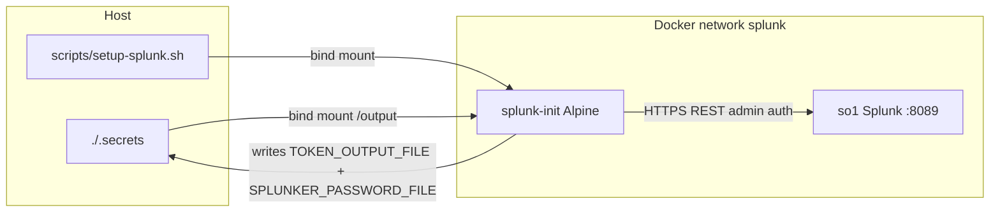
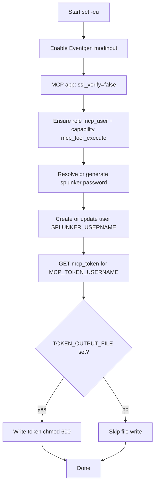
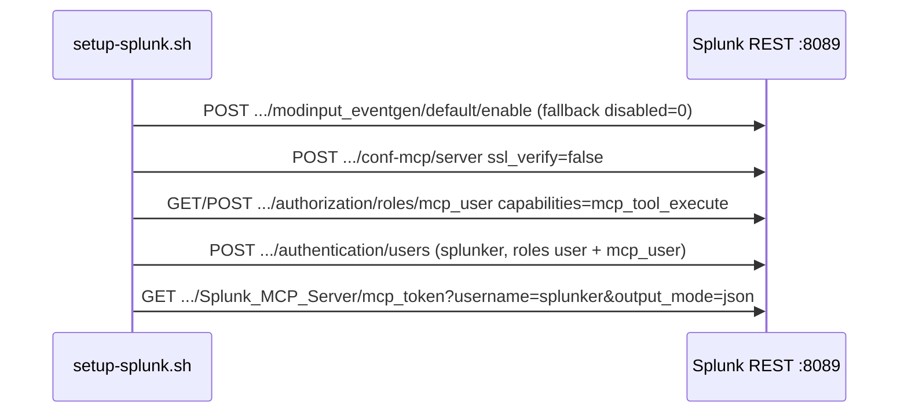

# `scripts/setup-splunk.sh` — reference and flow

This document describes **[`scripts/setup-splunk.sh`](../scripts/setup-splunk.sh)**: what it configures, how it behaves idempotently, which environment variables it reads, and how its helper functions fit together. It complements the shorter summary in [CONFIGURATION.md](CONFIGURATION.md).

## Purpose

The script bootstraps a **local Splunk Enterprise PoC** so that:

1. The **Splunk MCP Server** app can be used from clients (`mcp-remote`) with dev-friendly TLS settings.
2. **SA-Eventgen** sample data can run via the default modular input, when the app is installed.
3. Splunk has a dedicated **MCP execution identity**: Splunk role **`mcp_user`** (capability **`mcp_tool_execute`**), local user **`splunker`** by default, and an **encrypted MCP token** from the app’s `mcp_token` handler (not a plain JWT from `/services/authorization/tokens`).

The script is **`/bin/sh`**, uses **`set -eu`**, and talks to Splunk only through **HTTPS REST** (`curl -k` for local dev).

**Out of scope:** **`claude_logs`** index and monitors—add them in Splunk if you enable the bind mount (see [CONFIGURATION.md](CONFIGURATION.md)).

## Where it runs

In this repository, Compose starts an **`splunk-init`** one-shot container **after** `so1` (Splunk) is healthy. That container installs `curl` and `jq`, then executes this script. See [`compose.yml`](../compose.yml).

Typical environment inside `splunk-init` (from Compose):

| Variable | Example | Role |
| -------- | ------- | ---- |
| `SPLUNK_HOST` | `so1` | REST hostname on the Docker network |
| `SPLUNK_PORT` | `8089` | Management port |
| `SPLUNK_USER` | `admin` | REST login user |
| `SPLUNK_PASSWORD` | *(secret)* | REST password |
| `TOKEN_OUTPUT_FILE` | `/output/splunk-token` | Host path: `.secrets/splunk-token` |
| `SPLUNKER_PASSWORD_FILE` | `/output/splunker-password` | Host path: `.secrets/splunker-password` |

You can run the script manually on a host that reaches Splunk, with the same variables; if `TOKEN_OUTPUT_FILE` is unset, the token is still requested in Splunk but **not** written to disk.

## Configuration variables

| Variable | Default | Meaning |
| -------- | ------- | ------- |
| `SPLUNK_HOST` | `localhost` | REST host |
| `SPLUNK_PORT` | `8089` | REST port |
| `SPLUNK_USER` | `admin` | Authenticated user for REST (namespace for `mcp_token` call) |
| `SPLUNK_PASSWORD` | *(required)* | Admin password; **must** be set in the environment |
| `SPLUNKER_USERNAME` | `splunker` | Splunk user to create or update |
| `MCP_TOKEN_USERNAME` | `splunker` | Passed to `mcp_token?username=` (should match the MCP execution user) |
| `SPLUNKER_PASSWORD_FILE` | `.secrets/splunker-password` | If missing/empty, a password is generated and written here (`chmod 600`) unless an existing non-empty file is reused |
| `FORCE_SPLUNKER_PASSWORD` | `0` | If `1`/`true`, regenerate password even when `SPLUNKER_PASSWORD_FILE` exists |
| `TOKEN_OUTPUT_FILE` | `.secrets/splunk-token` | If set, encrypted token is written here (`chmod 600`) |
| `FORCE_MCP_TOKEN` | `0` | If `1`/`true`, request a new token even when `TOKEN_OUTPUT_FILE` is non-empty |
| `AUTH_CURL_QUIET` | *(internal)* | When `1`/`true`, suppresses stderr from failed `auth_curl` (used by helpers) |

**Refuses to run** if `MCP_TOKEN_USERNAME` or `SPLUNKER_USERNAME` is `admin` (tokens must not target the admin account).

## End-to-end execution order

High-level phases match the source order in the script.

## Sequence: REST interactions

The script uses **basic auth** on every `auth_curl` call: `-u "${SPLUNK_USER}:${SPLUNK_PASSWORD}"` with `curl -k`.

### Endpoint reference (no secrets in URLs)

| Step | Method | Path (relative to `https://HOST:PORT`) | Notes |
| ---- | ------ | ---------------------------------------- | ----- |
| Eventgen | POST | `/servicesNS/nobody/SA-Eventgen/data/inputs/modinput_eventgen/default/enable` | Fallback: same URL with `disabled=0` |
| MCP TLS dev | POST | `/servicesNS/nobody/Splunk_MCP_Server/configs/conf-mcp/server` | Body: `ssl_verify=false` |
| Role | GET/POST | `/services/authorization/roles/mcp_user` | Body: `capabilities=mcp_tool_execute` |
| User | POST | `/services/authentication/users` or `.../users/{name}` | Bodies: `roles=user`, `roles=mcp_user` |
| Token | GET | `/servicesNS/{SPLUNK_USER}/Splunk_MCP_Server/mcp_token` | Query: `username`, `output_mode=json` |

## Helper functions

### `auth_curl`

Wraps `curl` with admin credentials, captures HTTP status and body to a temp file, and normalizes behavior:

- **2xx/3xx**: prints body to stdout, deletes temp file, returns `0`.
- **Other**: optionally prints error to stderr (unless `AUTH_CURL_QUIET` is set), returns `1`.

### `must`

Runs a command and **`exit 1`** if it fails. Used for the `mcp_token` request.

### `read_secret_file`, `generate_password`

Load a one-line secret from a file, or generate a new password (OpenSSL preferred, `/dev/urandom` fallback).

### `splunk_get_json` / `wait_for_disabled_value`

Used to poll the Eventgen stanza until `disabled=0` when `jq` is available.

## Password and token handling

- **Password**: If `SPLUNKER_PASSWORD_FILE` is absent or empty, a new password is generated and written (unless you use an existing non-empty file and do not set `FORCE_SPLUNKER_PASSWORD`).
- **Token**: Parses JSON field `.token` with `jq`, or a **`sed`** fallback. Failure to extract a token **aborts** with `exit 1`.

## Idempotency and safe re-runs

Designed so **`make up` / `splunk-init` repeating** does not break:

- MCP `ssl_verify=false` is posted every run; failure is non-fatal (warning).
- Role `mcp_user` is updated or created; capability is set each run.
- User create/update tolerates existing users.
- Token generation is skipped when `TOKEN_OUTPUT_FILE` is non-empty unless `FORCE_MCP_TOKEN=1`.

## Security notes (dev PoC)

- **`curl -k`** disables TLS certificate verification: appropriate only for **local/dev** Splunk with the default Splunk certificate.
- **`ssl_verify=false`** in the MCP app config is **dev-only**; do not mirror this blindly in production.
- **Secrets**: never commit `.env`, `.secrets/splunk-token`, or `.secrets/splunker-password`. See [AGENTS.md](../AGENTS.md) and [SECURITY.md](SECURITY.md).

## Troubleshooting pointers

| Symptom | Likely cause | Where to read more |
| ------- | ------------ | ------------------ |
| “User lacks mcp_tool_execute capability” | `mcp_user` role missing capability | [TROUBLESHOOTING.md](TROUBLESHOOTING.md), re-run setup |
| Token empty / script exits 1 | MCP app missing or wrong version | Confirm `Splunk_MCP_Server` in `SPLUNK_APPS_URL` |
| No Claude logs | Index/monitor not created (minimal script) | [CONFIGURATION.md](CONFIGURATION.md); create index/monitor in Splunk |
| Eventgen warnings | SA-Eventgen not installed or URL changed | Check Splunkbase app install and REST path |

## Related documentation

- [CONFIGURATION.md](CONFIGURATION.md) — Compose, env files, Makefile, short setup list
- [OVERVIEW.md](OVERVIEW.md) — stack overview
- [ARCHITECTURE.md](ARCHITECTURE.md) — how `splunk-init` fits the architecture
- [API_REFERENCE.md](API_REFERENCE.md) — Splunk REST and MCP token flow
